# Fundamentos de Hashing e Integridade de Dados

> **Disciplina:** Segurança em Sistemas Computacionais — IFMT  
> **Tema:** Atividade Prática 1 — Fundamentos de Hashing e Integridade de Dados  
> **Dupla de Desenvolvimento:** Mateus & Lorena  
> **Data de Entrega:** 07/09/2026 até às 23h59  

<br>

---

<br>

## Visão Geral da Atividade

Este repositório contém a implementação prática da atividade da disciplina de **Segurança de Sistemas Computacionais** de ferramentas operacionais em Python desenvolvidas para verificação de integridade de sistemas de arquivos, simulação de módulos de autenticação seguros com *salts* criptográficos, análise de robustez de senhas contra ataques de dicionário e experimentos de detecção de colisões em larga escala.

Todo o código foi construído seguindo as restrições rígidas do enunciado:
* **Uso Unitário da Biblioteca `hashlib`:** A biblioteca é empregada exclusivamente para a operação matemática do cálculo de hash (`hashlib.sha256()`, `hashlib.sha1()`). Todas as lógicas de mapeamento, busca, comparação, estruturação de dados e geração de salts são autorais.
* **Proibição de Ferramentas de Alto Nível:** Não foram utilizadas bibliotecas prontas como `passlib`, `bcrypt` ou softwares externos de cracking (`hashcat`, `john the ripper`).
* **Eficiência de Memória:** Processamento de arquivos com leitura em blocos (*chunks* de 4 KB), suportando arquivos de grandes dimensões (> 1 GB) sem estouro de memória RAM, e manipulação de buffers de bytes brutos nos experimentos de colisão em massa.

<br>

### Fluxo Operacional e Ordem de Execução

```mermaid
flowchart TD
    classDef stage fill:#0369a1,stroke:#38bdf8,stroke-width:2px,color:#f8fafc,font-weight:bold;
    classDef step fill:#1e293b,stroke:#64748b,stroke-width:1px,color:#f8fafc;
    classDef test fill:#064e3b,stroke:#34d399,stroke-width:2px,color:#f8fafc,font-weight:bold;

    S1(["Etapa 1: Auditoria de Integridade de Arquivos"]):::stage
    A1["1.1 Mapear e Gerar Base<br/><code>verificador_integridade.py ./dados --base dados/hashes.txt</code>"]:::step
    A2["1.2 Auditar Integridade<br/><code>verificador_integridade.py ./dados --verificar --base dados/hashes.txt</code>"]:::step

    S2(["Etapa 2: Quebra de Hashes sem Salt"]):::stage
    B1["2.1 Ataque de Dicionário Manual<br/><code>quebra_sem_salt.py dados/hashes_sem_salt.txt dados/senhas_comuns.txt</code>"]:::step

    S3(["Etapa 3: Autenticação Segura com Salt (os.urandom)"]):::stage
    C1["3.1 Cadastrar Usuário com Salt de 16 Bytes<br/><code>cadastro_verificacao.py --cadastrar alice SenhaSegura@2026 --arquivo dados/usuarios.txt</code>"]:::step
    C2["3.2 Autenticar / Validar Login<br/><code>cadastro_verificacao.py --verificar alice SenhaSegura@2026 --arquivo dados/usuarios.txt</code>"]:::step

    S4(["Etapa 4: Ataque com Salt e Cache de Pré-computação"]):::stage
    D1["4.1 Força Bruta Otimizada com Dicionário<br/><code>quebra_com_salt.py dados/hashes_com_salt.txt dados/senhas_comuns.txt</code>"]:::step

    S5(["Etapa 5: Experimento de Colisões em Larga Escala"]):::stage
    E1["5.1 Teste Comparativo SHA-1 vs SHA-256 (1.000.000 amostras)<br/><code>detector_colisao.py --amostras 1000000 --algoritmo ambos</code>"]:::step

    S6(["Etapa 6: Suite de Testes Automatizados"]):::test
    T1["6.1 Validação Unitária e de Integração CLI<br/><code>python3 -m unittest discover tests</code>"]:::step

    S1 --> A1 --> A2 --> S2 --> B1 --> S3 --> C1 --> C2 --> S4 --> D1 --> S5 --> E1 --> S6 --> T1
```



<br>

---

<br>

## Estrutura do Repositório

```text
Fundamentos-Hashing-Integridade/
│
├── docs/
│   ├── 2-Hashing_na_Cibersegurança.pdf        # Slides conceituais do professor
│   ├── Atividade_Pratica_Seguranca_Hashing.pdf # Enunciado oficial da atividade
│   ├── Guia_Desenvolvimento_Hashing.md        # Roteiro e divisão de tarefas da dupla
│   └── Relatorio_Tecnico_Final.pdf            # Relatório técnico final em PDF
│
├── src/                                       # Código-fonte autoral dos scripts
│   ├── __init__.py
│   ├── verificador_integridade.py             # Item 2.1: Verificador de integridade de arquivos
│   ├── quebra_sem_salt.py                     # Item 2.2: Quebra de hashes sem salt
│   ├── cadastro_verificacao.py                # Item 2.3: Cadastro e login seguro com salt
│   ├── quebra_com_salt.py                     # Item 2.4: Quebra de hashes com salt (Bônus Cache)
│   └── detector_colisao.py                    # Item 2.5 / Fase 4: Detector de colisões SHA-1 vs SHA-256
│
├── dados/                                     # Massas de testes e dicionários
│   ├── hashes.txt                             # Base gerada de integridade de arquivos
│   ├── hashes_sem_salt.txt                    # Hashes SHA-256 alvo sem salt
│   ├── hashes_com_salt.txt                    # Hashes alvo com salt (salt:hash)
│   ├── senhas_comuns.txt                      # Dicionário de senhas comuns
│   └── usuarios.txt                           # Base de usuários gerada dinamicamente
│
├── tests/                                     # Suite de testes automatizados
│   └── test_scripts.py                        # Testes unitários e de integração CLI
│
└── README.md                                  # Documentação técnica central
```

<br>

---

<br>

## Scripts e Funções

### 1. `src/verificador_integridade.py` (Item 2.1)

Script responsável por mapear recursivamente um diretório, computar o hash SHA-256 de cada arquivo e realizar a auditoria de integridade comparando o estado atual contra uma base salva anteriormente.

#### Como Executar
```bash
# Modo 1: Mapear diretório e salvar estado em hashes.txt
python3 src/verificador_integridade.py ./diretorio_alvo --base hashes.txt

# Modo 2: Verificar integridade do diretório contra hashes.txt
python3 src/verificador_integridade.py ./diretorio_alvo --verificar --base hashes.txt
```

#### Detalhamento das Funções Internas

* **`calcular_hash_arquivo(caminho_arquivo, tamanho_bloco=4096)`**
  * **Objetivo:** Calcula o hash SHA-256 de um arquivo de forma segura e eficiente.
  * **Funcionamento:** Abre o arquivo em modo binário (`"rb"`) e consome os dados em blocos sucessivos de 4 KB através de `while bloco := arq.read(tamanho_bloco): sha256.update(bloco)`. Essa técnica impede que arquivos de múltiplos gigabytes sobrecarreguem a memória RAM.
  * **Retorno:** *String* hexadecimal de 64 caracteres do hash SHA-256 ou `None` em caso de falha de permissão/leitura.

* **`mapear_diretorio(diretorio_alvo, arquivo_hashes_ignorar=None)`**
  * **Objetivo:** Percorre toda a árvore de diretórios a partir do caminho indicado.
  * **Funcionamento:** Utiliza `os.walk()` para localizar todos os arquivos recursivamente. Converte caminhos absolutos para caminhos relativos padronizados e ignora automaticamente o arquivo de saída `hashes.txt` se ele estiver dentro do diretório inspecionado, evitando falsos positivos de alteração.
  * **Retorno:** Dicionário `{caminho_relativo: hash_sha256}`.

* **`salvar_hashes(hashes_dict, caminho_saida="hashes.txt")`**
  * **Objetivo:** Grava a tabela de integridade em disco.
  * **Funcionamento:** Escreve cada registro no formato estrito `caminho_do_arquivo:hash` ordenado alfabeticamente.

* **`carregar_hashes_salvos(caminho_arquivo)`**
  * **Objetivo:** Lê e decodifica o arquivo `hashes.txt` pré-existente.
  * **Funcionamento:** Realiza o *parse* de cada linha ignorando linhas em branco e comentários iniciados com `#`.
  * **Retorno:** Dicionário `{caminho_do_arquivo: hash_esperado}`.

* **`verificar_integridade(diretorio_alvo, caminho_hashes_base="hashes.txt")`**
  * **Objetivo:** Realiza o diagnóstico diferencial entre o estado salvo e o estado do sistema de arquivos atual.
  * **Funcionamento:** Aplica operações de conjuntos (*set differences* e interseções) para classificar e exibir em quatro categorias:
    * `Arquivos Novos`: presentes na pasta, mas ausentes na base.
    * `Arquivos Removidos`: presentes na base, mas não mais encontrados no disco.
    * `Arquivos Modificados`: presentes em ambos, porém com hashes divergentes.
    * `Arquivos Inalterados`: presentes em ambos com hashes estritamente idênticos.

* **`main()`**
  * **Objetivo:** Gerencia a interface de linha de comando com `argparse`.

<br>

---

<br>

### 2. `src/quebra_sem_salt.py` (Item 2.2)

Script que executa um ataque de dicionário manual sobre um conjunto de hashes SHA-256 desprovidos de *salt*.

#### Como Executar
```bash
python3 src/quebra_sem_salt.py dados/hashes_sem_salt.txt dados/senhas_comuns.txt
```

#### Detalhamento das Funções Internas

* **`carregar_linhas(caminho_arquivo)`**
  * **Objetivo:** Carrega a lista de hashes alvo.
  * **Funcionamento:** Lê o arquivo linha a linha, removendo espaços e quebras de linha nas extremidades e descartando linhas em branco.
  * **Retorno:** Lista de hashes em formato de texto.

* **`carregar_dicionario_senhas(caminho_arquivo)`**
  * **Objetivo:** Carrega a *wordlist* de senhas comuns candidatas.
  * **Funcionamento:** Realiza o tratamento com `rstrip("\r\n")`, preservando espaços em branco internos característicos de senhas válidas.
  * **Retorno:** Lista com as senhas em texto puro.

* **`quebrar_hashes_sem_salt(caminho_hashes, caminho_dicionario)`**
  * **Objetivo:** Executa a busca e cruzamento dos hashes.
  * **Funcionamento:** Calcula o hash SHA-256 unitário de cada palavra do dicionário via `hashlib.sha256(senha.encode('utf-8')).hexdigest()` e monta um mapa em memória. Em seguida, percorre os hashes alvo emitindo a saída exigida pelo professor:
    * Se a senha foi identificada: `hash:senha_encontrada`
    * Se a senha não foi identificada: `hash:NAO_ENCONTRADA`
  * **Retorno:** Tupla `(quebradas, nao_encontradas, total_hashes)`.

* **`main()`**
  * **Objetivo:** Orquestra a execução via CLI e apresenta no `stderr` as estatísticas de tempo e taxa de sucesso do ataque.

<br>

---

<br>

### 3. `src/cadastro_verificacao.py` (Item 2.3)

Módulo que implementa as boas práticas de armazenamento e conferência de credenciais utilizando *salts* aleatórios de 16 bytes.

#### Como Executar
```bash
# Modo Cadastro de Usuário
python3 src/cadastro_verificacao.py --cadastrar alice SenhaSegura@2026 --arquivo dados/usuarios.txt

# Modo Verificação de Login
python3 src/cadastro_verificacao.py --verificar alice SenhaSegura@2026 --arquivo dados/usuarios.txt
```

#### Detalhamento das Funções Internas

* **`carregar_base_usuarios(caminho_arquivo)`**
  * **Objetivo:** Lê a base de credenciais armazenada em disco.
  * **Funcionamento:** Faz a leitura do arquivo `usuarios.txt` delimitado por dois pontos (`:`).
  * **Retorno:** Dicionário `{usuario: (salt_hex, hash_hex)}`.

* **`salvar_base_usuarios(usuarios_dict, caminho_arquivo)`**
  * **Objetivo:** Salva o banco de credenciais de forma atômica e ordenada.
  * **Funcionamento:** Grava cada usuário no padrão `usuario:salt_hex:hash_hex`. A senha em texto claro **nunca** é gravada em disco.

* **`cadastrar_usuario(usuario, senha, caminho_arquivo="usuarios.txt")`**
  * **Objetivo:** Registra um novo usuário com um *salt* exclusivo e criptograficamente seguro.
  * **Funcionamento:**
    1. Gera 16 bytes pseudoaleatórios imprevisíveis usando `os.urandom(16)`.
    2. Concatena os bytes do salt aos bytes da senha (`salt_bytes + senha.encode('utf-8')`).
    3. Calcula o hash SHA-256 da concatenação.
    4. Converte o salt para representação hexadecimal (`salt.hex()`) e persiste no arquivo `usuarios.txt`.

* **`verificar_autenticacao(usuario, senha, caminho_arquivo="usuarios.txt")`**
  * **Objetivo:** Autentica um usuário que está tentando efetuar login.
  * **Funcionamento:**
    1. Localiza o usuário no banco de dados. Se não existir, emite imediatamente `"Acesso negado"`.
    2. Recupera a representação hexadecimal do salt e converte de volta para bytes com `bytes.fromhex(salt_hex)`.
    3. Concatena o salt recuperado com a senha informada na tentativa e calcula o hash SHA-256.
    4. Compara o hash calculado com o hash gravado.
    5. Se idênticos, imprime `"Acesso permitido"`; caso contrário, imprime `"Acesso negado"`.
  * **Retorno:** Booleano indicando o status da autenticação (`True` ou `False`).

* **`main()`**
  * **Objetivo:** Define o grupo mutuamente exclusivo de argumentos de linha de comando (`--cadastrar` e `--verificar`).

<br>

---

<br>

### 4. `src/quebra_com_salt.py` (Item 2.4)

Script desenvolvido para quebrar hashes que possuem *salt* conhecido (`salt_hex:hash_hex`), incorporando a solução do **Desafio Bônus de Pré-computação Otimizada**.

#### Como Executar
```bash
python3 src/quebra_com_salt.py dados/hashes_com_salt.txt dados/senhas_comuns.txt
```

#### Detalhamento das Funções Internas

* **`carregar_dicionario_senhas(caminho_arquivo)`**
  * **Objetivo:** Carrega a lista de senhas comuns candidatas em memória.

* **`carregar_hashes_com_salt(caminho_arquivo)`**
  * **Objetivo:** Realiza o *parse* do arquivo de hashes protegidos por salt.
  * **Funcionamento:** Separa cada linha em `salt_hex` e `hash_hex`.
  * **Retorno:** Lista de tuplas `[(salt_hex, hash_hex), ...]`.

* **`quebrar_hashes_com_salt(caminho_hashes, caminho_dicionario)`**
  * **Objetivo:** Executa o ataque de força bruta inteligente com dicionário.
  * **Implementação do Desafio Bônus:**
    * Mantém uma estrutura de cache em memória indexada por `salt_hex`: `{salt_hex: {hash_gerado: senha}}`.
    * Quando um salt inédito é processado, calcula o hash SHA-256 para todas as senhas da wordlist combinadas com aquele salt específico e armazena no cache.
    * Caso o mesmo salt seja reutilizado em outros hashes do arquivo, o script reutiliza instantaneamente o dicionário já computado para aquele salt, evitando recálculos caros.
  * **Formato de Saída:**
    * `salt:hash -> senha_encontrada`
    * `salt:hash -> NAO_ENCONTRADA`
  * **Retorno:** Métricas contendo total de senhas quebradas, não encontradas, quantidade de salts únicos e contagem de reutilizações de cache.

* **`main()`**
  * **Objetivo:** Entrada CLI e apresentação dos dados de telemetria no `stderr`.

<br>

---

<br>

### 5. `src/detector_colisao.py` (Item 2.5 / Fase 4 — Extra com Bônus)

Script responsável por realizar testes empíricos de detecção de colisões em larga escala comparando os algoritmos **SHA-1** (obsoleto, 160 bits) e **SHA-256** (seguro, 256 bits).

#### Como Executar
```bash
# Execução padrão (1.000.000 amostras, comparando SHA-1 e SHA-256)
python3 src/detector_colisao.py

# Execução customizada com número menor/maior de amostras ou algoritmo específico
python3 src/detector_colisao.py --amostras 1000000 --tamanho-bytes 10 --algoritmo ambos
python3 src/detector_colisao.py --amostras 500000 --algoritmo sha1
```

#### Detalhamento das Funções Internas

* **`gerar_amostra_aleatoria(tamanho_bytes=10)`**
  * **Objetivo:** Gera amostras criptograficamente aleatórias e imprevisíveis.
  * **Funcionamento:** Utiliza `os.urandom(tamanho_bytes)` para obter sequências de bytes com alta entropia.
  * **Retorno:** Objeto `bytes` de tamanho especificado.

* **`testar_colisoes_algoritmo(nome_algoritmo, total_amostras=1000000, tamanho_bytes=10)`**
  * **Objetivo:** Executa a bateria de testes de colisão e mede a eficiência temporal.
  * **Funcionamento:**
    1. Itera gerando `total_amostras` entradas aleatórias.
    2. Calcula o hash no formato de bytes brutos (`.digest()`), reduzindo o consumo de memória RAM pela metade em relação a strings hexadecimais.
    3. Indexa os hashes em um dicionário `{hash_digest: amostra_bytes}`.
    4. Caso um hash repetido seja encontrado, compara as entradas para comprovar colisão genuína (`amostra_anterior != amostra_atual`).
    5. Mede o tempo decorrido com precisão de milissegundos.
  * **Retorno:** Dicionário com estatísticas consolidadas (`total_amostras`, `hashes_unicos`, `total_colisoes`, `tempo_segundos`).

* **`exibir_relatorio_experimento(resultados, tamanho_bytes=10)`**
  * **Objetivo:** Formata e imprime na tela o relatório comparativo e a tabela de resumo dos testes.

* **`main()`**
  * **Objetivo:** Gerencia argumentos de CLI com `argparse` (`--amostras`, `--tamanho-bytes`, `--algoritmo`).

<br>

---

<br>

## Testes Automatizados

O projeto conta com uma suite de testes unitários e de integração em [tests/test_scripts.py](tests/test_scripts.py).

Para executar todos os testes automatizados:
```bash
python3 -m unittest discover tests
```

### Casos de Teste Validados:
1. **`test_verificador_integridade`:** Criação de ambiente temporário e validação exata dos quatro estados de arquivo (novos, removidos, modificados e inalterados).
2. **`test_quebra_sem_salt`:** Validação da saída padronizada `hash:senha` e `hash:NAO_ENCONTRADA`.
3. **`test_cadastro_verificacao`:** Cadastro de múltiplos usuários com a mesma senha (comprovando salts e hashes resultantes diferentes) e teste de login com credenciais válidas e inválidas.
4. **`test_quebra_com_salt`:** Validação do ataque contra hashes com salt e verificação do funcionamento do cache de pré-computação.
5. **`test_detector_colisao`:** Execução automatizada do gerador e comparador de colisões SHA-1 vs SHA-256.

<br>

---

<br>

## Considerações de Segurança

1. **Geração Criptográfica de Números Aleatórios:** O uso de `os.urandom(16)` assegura entropia proveniente do CSPRNG do sistema operacional (`/dev/urandom`), impedindo previsibilidade de salts e chaves.
2. **Resistência a Rainbow Tables:** O acréscimo do salt de 16 bytes inviabiliza o uso de tabelas pré-computadas genéricas, obrigando o invasor a computar o dicionário individualmente para cada salt distinto.
3. **Persistência de Dados:** O sistema armazena apenas representações hexadecimais de hashes e salts, garantindo que mesmo diante de um vazamento total da base `usuarios.txt`, as senhas em texto claro permaneçam inacessíveis.
4. **Reflexão sobre SHA-1 vs SHA-256 (Colisões):**
   * Pelo **Paradoxo do Aniversário**, a busca aleatória de colisões no SHA-1 exige em média $2^{80} \approx 1,2 \times 10^{24}$ operações, tornando colisões espontâneas extremamente improváveis em 1.000.000 ($10^6$) de amostras aleatórias.
   * Contudo, ataques criptoanalíticos direcionados modernos (como o ataque **SHAttered** do Google/CWI em 2017) reduziram a complexidade teórica do SHA-1 para $2^{63}$ operações, tornando-o matematicamente quebrado contra ataques de colisão com prefixo escolhido (*chosen-prefix collision*).
   * O **SHA-256**, por sua vez, possui resistência teórica a colisões de $2^{128} \approx 3,4 \times 10^{38}$ operações e não possui fraquezas conhecidas, sendo indispensável para qualquer aplicação moderna de integridade e assinaturas digitais.
